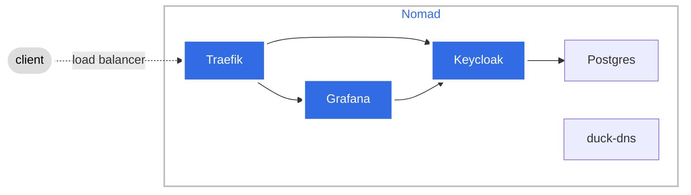

# Hylastix Candidate Test
### Simple Architecture

#### Improvments
* Variable naming to better describe what variable is used for.
* Using valid domain instead of dynamic dns service.
* Expanding configuration templates for Consul and Nomad.
* Improving github actions to have clear separation of jobs, instead having only one job.
* Expanding terraform code to deploy full cluster instead single node cluster.
* Implement Azure availability zones with terraform.
* Enable persistant sotorage for Nomad cluster with managed disk or with CSI.
* Move Keycloak ansible task into separate role.
* Dynamically add/remove nsg rule for github actions runner.
 
## Pre-requisites
* [ansible](https://docs.ansible.com/ansible/latest/installation_guide/installation_distros.html)
* [Terraform](https://developer.hashicorp.com/terraform/install?product_intent=terraform)
* Azure Service Principal
* Azure Storage Account for storing the state file

Ansible Role(s) Variables
--------------

| Name | Value | Description |
|---|---|---|
| consul_server | Default = false | Set VM to Consul server |
| data_center_name | Default = "dc1" | Data Center Name |
| enable_local_script_checks | Default = false | Enable script checks in Consul |
| bootstrap_expect |Default = 1 | Consul/Nomad how many servers to bootstrap |
| docker_sock_enabled | Default = false | Add docker socket readonly volume map in nomad configuration | 
| docker_privileged_mode | Default = false | Enable docker to run in privileged mode |
| nomad_ui_label_backgroung_color | Default = "purple" | Set label background color in Nomad UI | 
| nomad_ui_label_text_color | Default = "white" | Set label color in Nomad UI |
| psql_password | Default = "changeme" | Psql Server password |
| keycloak_admin_user | Default = "admin" | Set Keycloak admin user |
| keycloak_admin_password | Default = "changeme" | Set Keycloak admin user password |
| kc_grafana_client_roles | Default = ['admin','editor','viewer'] | Keycloak client roles for Grafana |
| kc_realm_name | Default = "grafana" | Keycloak realm name |
| kc_client_name | Default = "grafana-oauth" | Keycloak client name |
| kc_client_secret | Default = "dummy string" | Keycloak client secret |
| kc_url | Default = "keycloak.hyl" | Keycloak URL |
| grafana_url | Default = "grafana.hyl" | Grafana URL |
| grafana_oauth_tls_skip_verify | Default = true | Grafana skip cert validation for oauth login |
| nomad_url | Default = "nomad.hyl" | Nomad URL |
| consul_url | Default = "consul.hyl" | Consul URL |
| kc_user_grafana_realm | Default = kc_user_grafana_realm:<br>&nbsp;&nbsp;&nbsp;&nbsp;&nbsp;-name: user1<br>&nbsp;&nbsp;&nbsp;&nbsp;&nbsp;&nbsp;&nbsp;password: changeme<br>&nbsp;&nbsp;&nbsp;&nbsp;&nbsp;&nbsp;&nbsp;role: viewer | Keycloak client dummy users with mapped client roles |
| duck_dns_token | Default = "dummy string" | Token for Duckdns to update ip of dns records |
| letsencrypt_email | Default = "dummy string" | Email to allow traefik to generate let's encrypt certificates |
| top_domain | Default = "duckdns.org" | Duckdns domain |
**Note:** If you want to override default values, please change values in the inventory file.

### Example inventory file
```
consul_server:
  hosts:
    hylvm:
      ansible_host: xxx.xxx.xxx.xxx
      ansible_user: adminuser
      data_center_name: dev
      consul_server: true
```
## Notes, Tips and Troubleshooting
* export ANSIBLE_HOST_KEY_CHECKING=False
* consul_server_ips Ansible variable will look for server group named **consul_server** in inventory file to fill proper IPs for retry_join stanza in Consul configuration
* Environment is ephemeral 
* Environment depends on cloudns (Dynamic DNS). Cron job is checking for IP change every 3 minutes.
* If 404 code emerges use https when typing url(s)
* Certificates are dynamically created by traefik. If certificate is not valid that means that default traefik certificate is used. In this case login to Grafana will fail Check traefik logs in nomad UI to resolve the problem.
    * ACME protocol rate limit: `ERR Unable to obtain ACME certificate for domains error="unable to generate a certificate for the domains [keycloak.hyl.ip-ddns.com]: acme: error: 429 :: POST :: https://acme-v02.api.letsencrypt.org/acme/new-order :: urn:ietf:params:acme:error:rateLimited :: too many certificates (50) already issued for \"ip-ddns.com\" in the last 168h0m0s, retry after 2024-11-04 13:52:22 UTC`
    * DNS can't reslove domain record `ERR Unable to obtain ACME certificate for domains error="unable to generate a certificate for the domains [hyl-nomad.duckdns.org]: error: one or more domains had a problem:\n[hyl-nomad.duckdns.org] acme: error: 400 :: urn:ietf:params:acme:error:dns :: DNS problem: SERVFAIL looking up A for hyl-nomad.duckdns.org - the domain's nameservers may be malfunctioning; DNS problem: SERVFAIL looking up AAAA for hyl-nomad.duckdns.org - the domain's nameservers may be malfunctioning\n"`